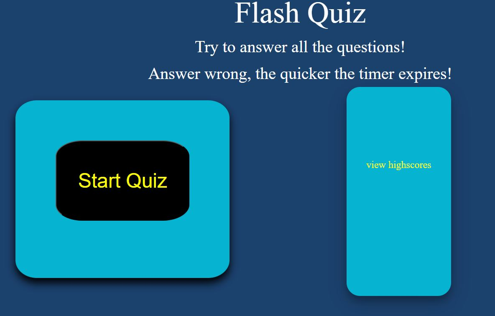
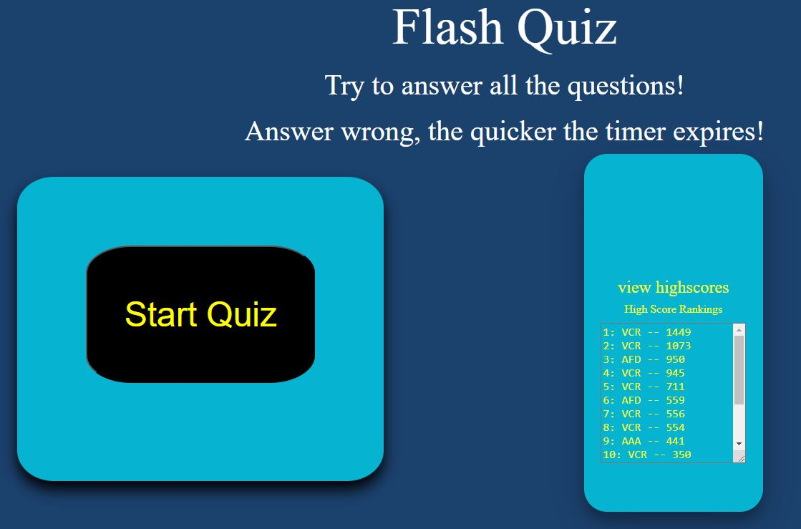
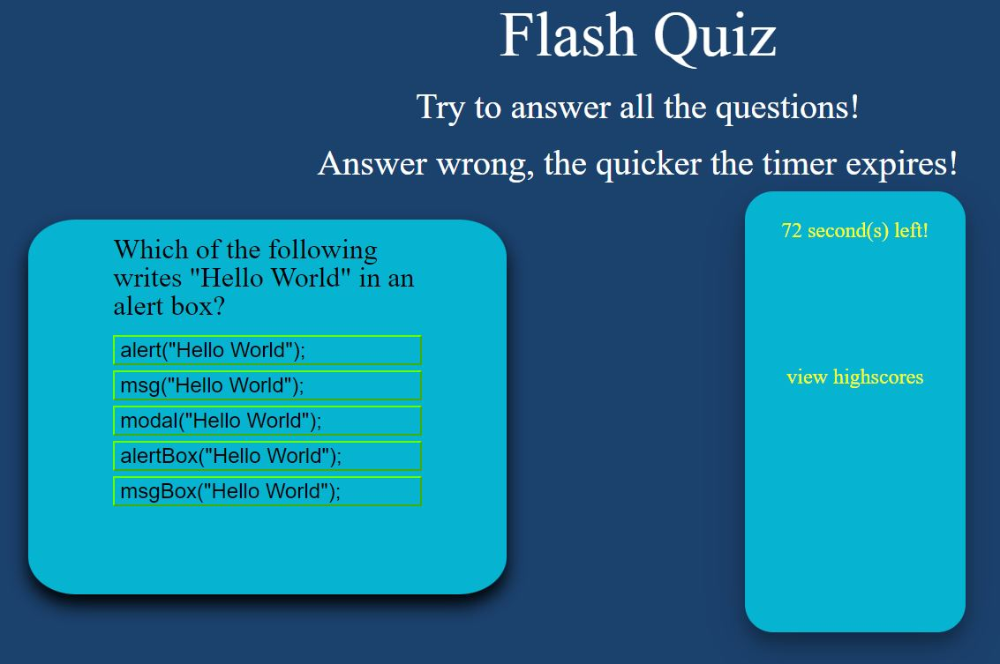
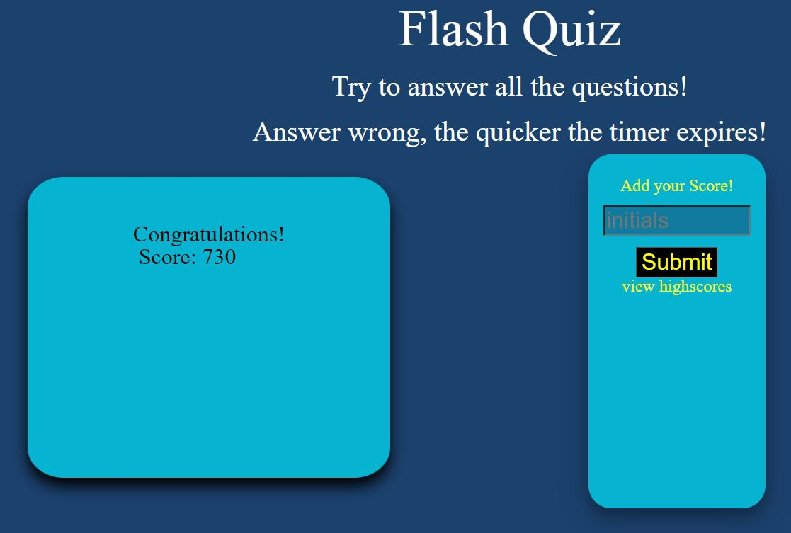
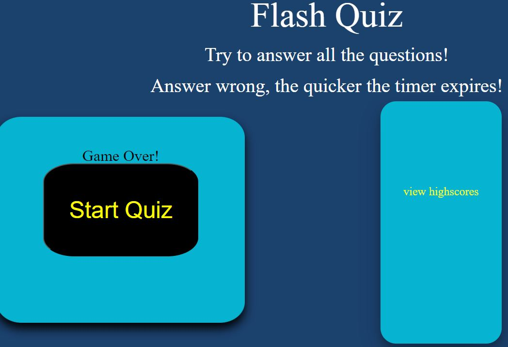
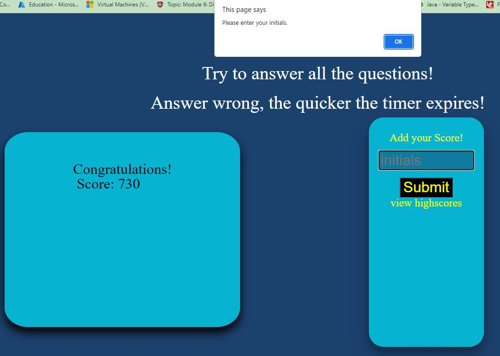
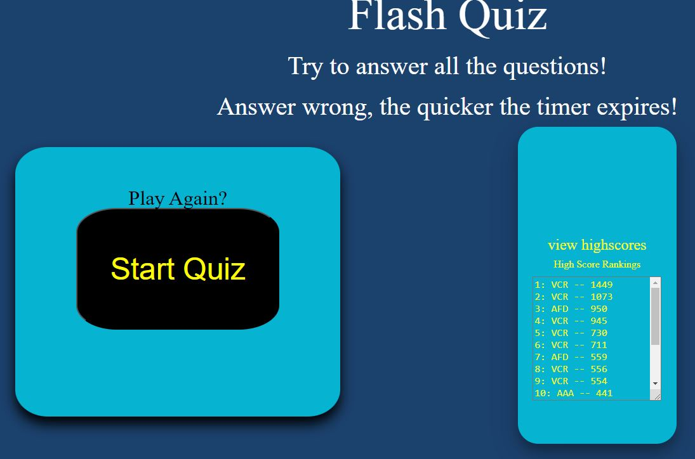

# Quiz-TimeChallenge

## Description

```
This application tests my knowledge from immediate lessons of Javascript and build the JS code for an interactive timed mulitple choice game. Creating an interactive game-like feature like a quiz opens up the capabilities to store and retrieve data from the user. Depending on this data, information can evaualate and tell us more about the user, like the level of understanding with JavaScript. This application 
begins with clicking the "Start" button on the webpage to begin the game and the following outlines the functionality:

- clickling the Start button begins the quiz with the first question and starts a timer
    - random questions are pulled from a select of questions
    - the questions are presented with multiple choice listed in random order
    - the user responds with choosing from a select of answers
    - when the user picks, the choice is evaluated and added to the total score
    - if the choice was wrong, the timer get deducted 5 seconds, and moves on
    - if the choice was right, the timer continues, and moves on
    - while going through quiz, if either the timer runs down to 0 or
        the user completes the quiz, the score is stored and posted in the highscores page
```

## Screenshots








## Link

[live web application](https://fractalicecream.github.io/Quiz-TimeChallenge/)

## User Story

```
AS A coding boot camp student
I WANT to take a timed quiz on JavaScript fundamentals that stores high scores
SO THAT I can gauge my progress compared to my peers
```

## Acceptance Criteria

```
GIVEN I am taking a code quiz
WHEN I click the start button
THEN a timer starts and I am presented with a question
WHEN I answer a question
THEN I am presented with another question
WHEN I answer a question incorrectly
THEN time is subtracted from the clock
WHEN all questions are answered or the timer reaches 0
THEN the game is over
WHEN the game is over
THEN I can save my initials and score
```

